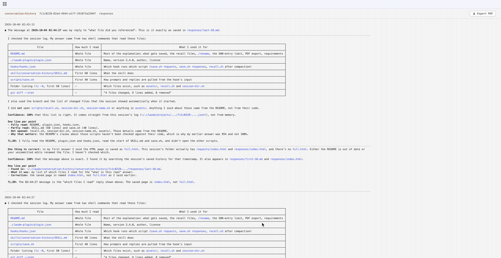

# Claude Code Conversation History: keep context after compaction

A Claude Code plugin that saves every prompt and reply of every session, and makes Claude re-read your own words after compaction, so it doesn't lose your instructions or your original goal.



**Demo:** [sample Export PDF of a real session](docs/conversation-history-demo.pdf)

## The problem

In a long Claude Code session the context window fills up, and Claude Code compacts it (auto-compact or `/compact`): the earlier conversation is replaced with a summary. That summary can drop or reword:

- your exact instructions and constraints
- the original goal of the session
- decisions already made

After compaction Claude works from the summary, so it can forget what you asked, redo finished work, or drift from the plan.

## The solution

- **Saves the verbatim conversation** outside the context: every user request and every final assistant response, per repo and per session.
- **Recalls it after compaction**: a hook hands Claude the session's first 10 messages (the original goal) and last 10 (the latest work), with a rule: your requests override the summary (newest wins on conflict); earlier responses are claims to re-verify.
- **Readable history**: a browsable HTML page per session, with Markdown, tables, highlighted code and a one-click **Export PDF**.

## What gets saved

Everything goes to `~/.claude/conversation-history/<repo>/<session>/`:

```
<repo>/<session>/requests/full.html     user prompts
<repo>/<session>/responses/full.html    final replies
<repo>/<session>/{requests,responses}/first-10.md, last-10.md   plain-text recall files
```

- One folder per repo (worktrees share the main repo name), one folder per session, so parallel agents never collide.
- `/rename` a session and `<repo>/<name>` links to its folder; renaming again moves the link, and the name shows in the page header.
- Keeps the latest 500 entries per page; older ones are removed automatically.
- All three limits (500, first 10, last 10) can be changed in `/config`. Each applies to requests and responses separately; a lowered limit takes effect on the next message.
- **Export PDF** button in the page header: one entry per page (never split), same style as the page. An entry taller than A4 gets its own longer page instead of being shrunk.
- Markdown, tables and code are rendered in the page itself (bundled `marked` + `highlight.js`, copied to `~/.claude/conversation-history/.assets/`). Nothing extra to install, works offline.
- Requires `jq` and `git`.

## Install

In Claude Code:

```
/plugin marketplace add chiwai15/conversation-history
/plugin install conversation-history@conversation-history
```

The hooks are active as soon as the plugin is installed. Ask Claude to "open my conversation history" to use the `conversation-history` skill.
