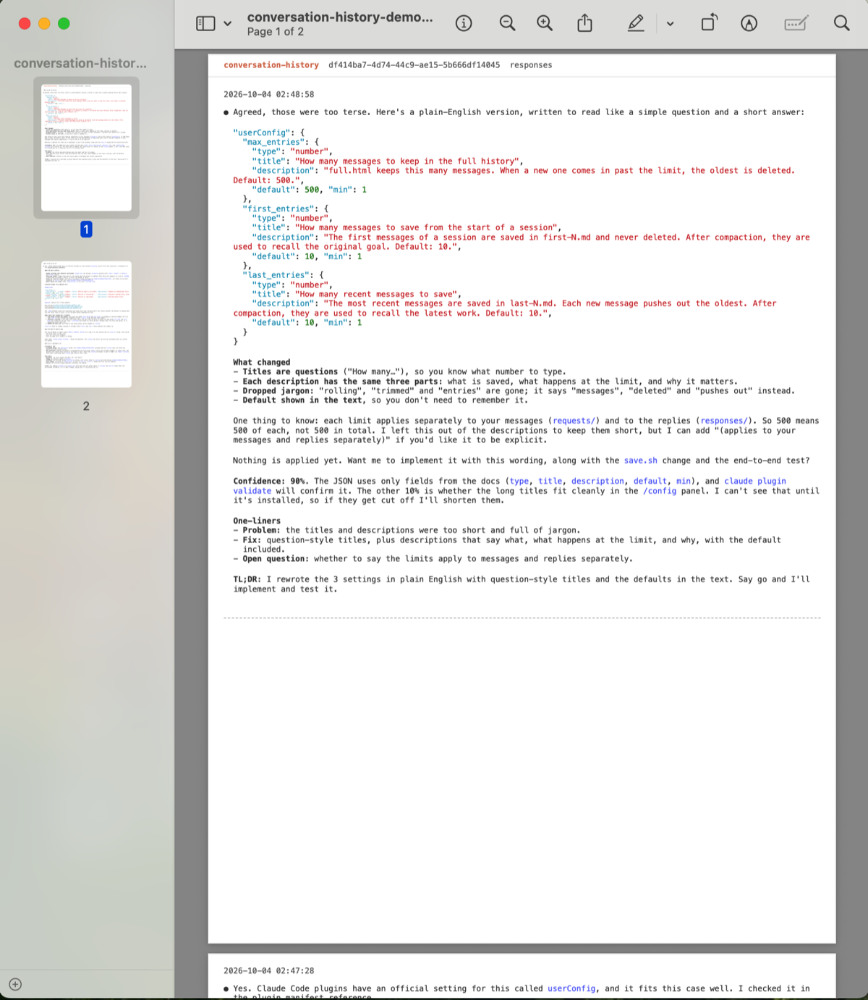

# Claude Code Conversation History: keep context after compaction

[](https://github.com/Chiwai15/conversation-history/actions/workflows/ci.yml)
[](https://github.com/Chiwai15/conversation-history/releases)
[](LICENSE)
[](https://github.com/Chiwai15/conversation-history/stargazers)

A Claude Code plugin that does two things:

1. **Saves your conversation history** in Claude Code's terminal output format, every prompt and reply of every session, with a one-click export to PDF for printing.
2. **Gives Claude context after compaction**: it re-reads your own words, so it doesn't lose your instructions or your original goal.


**Demo:** [sample Export PDF of a real session](docs/conversation-history-demo.pdf)

## The problem

1. **Your conversation is hard to keep.** Replies scroll away in the terminal, and the only saved copy is a raw JSONL transcript in `~/.claude/projects/`, which isn't readable as a conversation, and can't be shared or printed in the format you saw.
2. **Compaction loses context.** In a long session the context window fills up, and Claude Code compacts it (auto-compact or `/compact`): the earlier conversation is replaced with a summary. That summary can drop or reword:
   - your exact instructions and constraints
   - the original goal of the session
   - decisions already made

   After compaction Claude works from the summary, so it can forget what you asked, redo finished work, or drift from the plan.

### Sound familiar?

- **How do I save a Claude Code conversation?** Install the plugin. Every prompt and reply is saved automatically, per repo and per session.
- **Where are Claude Code conversations stored?** Claude Code keeps raw JSONL transcripts in `~/.claude/projects/`. This plugin keeps a readable copy in `~/.claude/conversation-history/<repo>/<session>/`.
- **How do I save Claude Code terminal output to a file?** Each session is saved as a page that looks like the terminal: monospace text, `●` reply markers, tables and highlighted code.
- **How do I export a Claude Code conversation to PDF?** Open the page and click **Export PDF**.
- **How do I export a Claude Code chat to Markdown?** Replies are rendered from their original Markdown, and each session's first and last 10 entries are also kept as `.md` files.
- **How do I view Claude Code session history?** Open a session's page; entries are timestamped, newest first, and a `/rename` name links to its folder.
- **Claude Code chat history lost or disappeared?** This plugin keeps its own copy in a separate folder, so it doesn't depend on the transcripts.
- **Does Claude Code forget instructions after `/compact`?** It works from a summary that can drop them. After compaction, this plugin hands Claude your first and last 10 messages word for word.

## The solution

1. **Saves the conversation history in terminal output format**: every user request and every final assistant response, per repo and per session, outside the context. Each session is a browsable HTML page styled like Claude Code's terminal output, with the same monospace text, `●` reply markers, terminal-style tables and highlighted code, plus a one-click **Export PDF** in the same style for printing.
2. **Provides context for compaction**: a hook hands Claude the session's first 10 messages (the original goal) and last 10 (the latest work), with a rule: your requests override the summary (newest wins on conflict); earlier responses are claims to re-verify.

## Install

In Claude Code:

```
/plugin marketplace add chiwai15/conversation-history
/plugin install conversation-history@conversation-history
```

The hooks are active as soon as the plugin is installed. Ask Claude to "open my conversation history" to use the `conversation-history` skill.

## Where it's saved

```
~/.claude/conversation-history/<repo>/<session>/
├── requests/full.html      your prompts
├── responses/full.html     Claude's replies
└── {requests,responses}/first-10.md, last-10.md   recall files used after compaction
```

## Export or print to PDF

1. Open a saved page, e.g. `open ~/.claude/conversation-history/<repo>/<session>/responses/full.html` (`xdg-open` on Linux), or ask Claude to "export my responses to PDF".
2. Click **Export PDF** in the header, then choose **Save as PDF**, or pick a printer to print on paper.



- An entry is never split across pages (short ones may share a page); an entry taller than A4 gets its own longer page instead of being shrunk.
- Same look as the page, on a white background to save ink; the button is hidden in the output.
- From the shell (Chrome, headless):

```
"/Applications/Google Chrome.app/Contents/MacOS/Google Chrome" --headless --no-pdf-header-footer \
  --print-to-pdf=out.pdf "file://$HOME/.claude/conversation-history/<repo>/<session>/responses/full.html"
```

## Requirements

- macOS or Linux with `bash`
- `jq` (required; without it nothing is saved)
- `git` (optional; used to name the repo folder, otherwise the project folder name is used)

## Troubleshooting

- **Nothing is saved**: hooks load at session start. Run `/reload-plugins` or start a new session, and check that `jq` is installed.
- **Old pages still look old**: styles are shared from `~/.claude/conversation-history/.assets/` and refresh on your next message.
- **What is not saved**: images, subagent replies, and intermediate messages; only the final reply of each turn is kept.

## Feedback and support

Found a bug or have an idea? [Open an issue](https://github.com/Chiwai15/conversation-history/issues/new/choose); suggestions and feedback are welcome.

If this plugin saved your context, a ⭐ on [GitHub](https://github.com/Chiwai15/conversation-history) helps other Claude Code users find it.

## License

[MIT](LICENSE)
